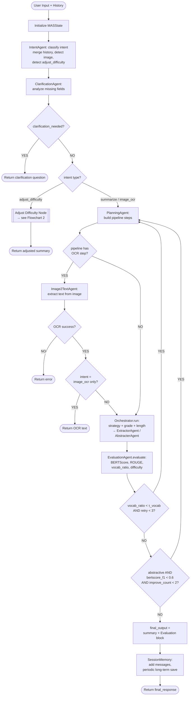

```mermaid
flowchart TD
    START([User Input + History]) --> INIT[Initialize MASState]
    INIT --> INTENT[IntentAgent: classify intent\nmerge history, detect image,\ndetect adjust_difficulty]

    INTENT --> CLAR[ClarificationAgent:\nanalyze missing fields]

    CLAR --> CLAR_CHK{clarification_needed?}
    CLAR_CHK -- YES --> RETURN_Q([Return clarification question])

    CLAR_CHK -- NO --> ROUTE_INTENT{intent type?}

    ROUTE_INTENT -- adjust_difficulty --> ADJ_DIFF[[Adjust Difficulty Node\n→ see Flowchart 2]]
    ADJ_DIFF --> RETURN_ADJ([Return adjusted summary])

    ROUTE_INTENT -- summarize / image_ocr --> PLAN[PlanningAgent:\nbuild pipeline steps]

    PLAN --> HAS_OCR{pipeline has\nOCR step?}
    HAS_OCR -- YES --> OCR[Image2TextAgent:\nextract text from image]
    OCR --> OCR_OK{OCR success?}
    OCR_OK -- NO --> RETURN_ERR([Return error])
    OCR_OK -- YES --> IS_OCR_ONLY{intent =\nimage_ocr only?}
    IS_OCR_ONLY -- YES --> RETURN_OCR([Return OCR text])
    IS_OCR_ONLY -- NO --> SUMM

    HAS_OCR -- NO --> SUMM[Orchestrator.run:\nstrategy + grade + length\n→ ExtractorAgent / AbstracterAgent]

    SUMM --> EVAL[EvaluationAgent.evaluate:\nBERTScore, ROUGE,\nvocab_ratio, difficulty]

    EVAL --> VOCAB_CHK{vocab_ratio < τ_vocab\nAND retry < 3?}
    VOCAB_CHK -- YES --> PLAN
    VOCAB_CHK -- NO --> BERT_CHK{abstractive AND\nbertscore_f1 < 0.6\nAND improve_count < 2?}
    BERT_CHK -- YES --> PLAN
    BERT_CHK -- NO --> FINAL[final_output =\nsummary + Evaluation block]

    FINAL --> STORE[SessionMemory:\nadd messages,\nperiodic long-term save]
    STORE --> RETURN_FINAL([Return final_response])
```